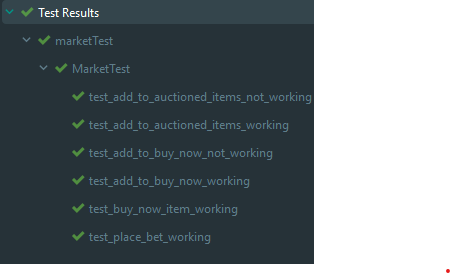

## Testing market backend in the api:

### I prepared unit tests using python module unittest, with the code below:

    import unittest
    
    from api.web.user import User
    
    global user
    global hero
    
    
    class MarketTest(unittest.TestCase):
    
            @classmethod
            def setUpClass(cls):
                try:
                    global user
                    user = User()
                    user.login('uniTest@test.ts', 'testing123')
                    user.chooseHero(12)
                    global hero
                    hero = user.currentHero
                    hero.buy_from_shop(0, 0)
                    hero.buy_from_shop(1, 0)
                    user.logout()
                    user.login('uniTest@test.ts', 'testing123')
                    user.chooseHero(12)
        
                except Exception as error:
                    print(error)
        
            def test_add_to_buy_now_working(self):
                status: bool = hero.add_to_buy_now_items(11, 5)
                self.assertTrue(status)
                self.assertTrue(hero.market.buy_now_items[0] is not None)
        
            def test_add_to_buy_now_not_working(self):
                status: bool = hero.add_to_buy_now_items(0, 2)
                self.assertFalse(status)
        
            def test_add_to_auctioned_items_working(self):
                status: bool = hero.add_to_auctioned_items(12, 5)
                self.assertTrue(status)
        
            def test_add_to_auctioned_items_not_working(self):
                status: bool = hero.add_to_auctioned_items(0, 3)
                self.assertFalse(status)
        
            def test_buy_now_item_working(self):
                status: bool = hero.buy_now_item(0)
                self.assertTrue(status)
        
            def test_place_bet_working(self):
                status: bool or object = hero.place_bet(0, 20)
                self.assertTrue(status is not False)
        
            @classmethod
            def tearDownClass(cls):
                user.logout()
        
        
        if __name__ == '__main__':
            unittest.main()

### The results:

### Aim of the tests?
I wanted to verify whether both adding and using buy_now & auctioning on the market is working.
It appears to be so.